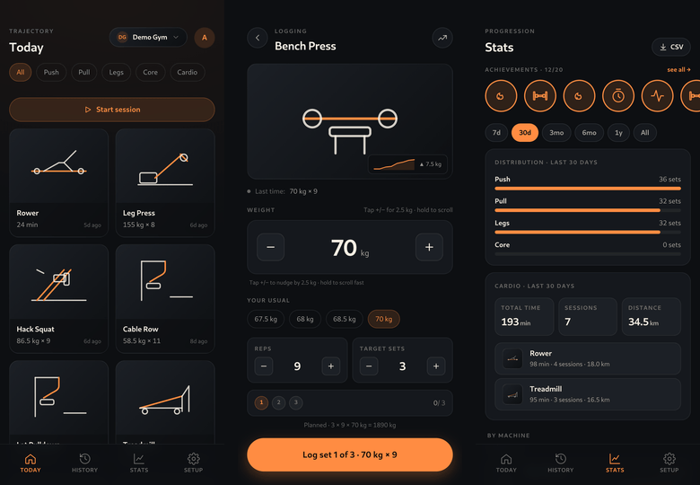
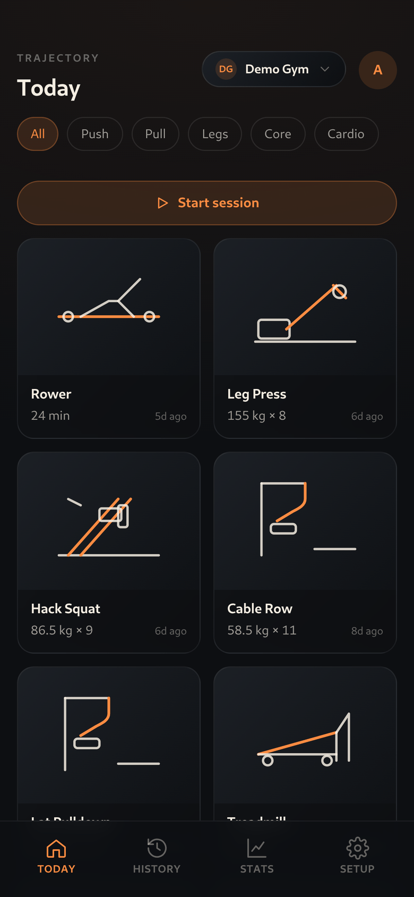
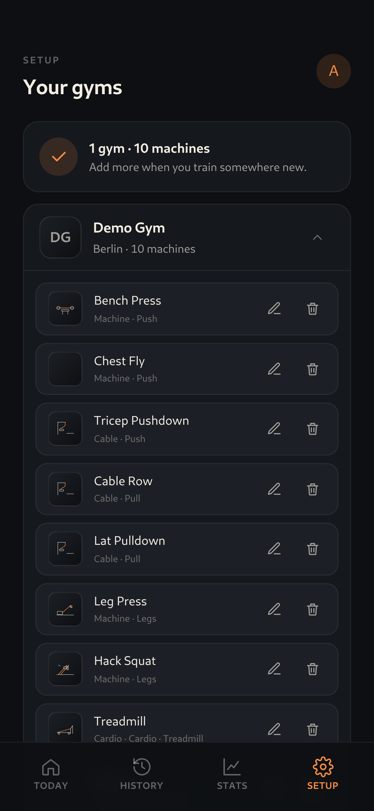
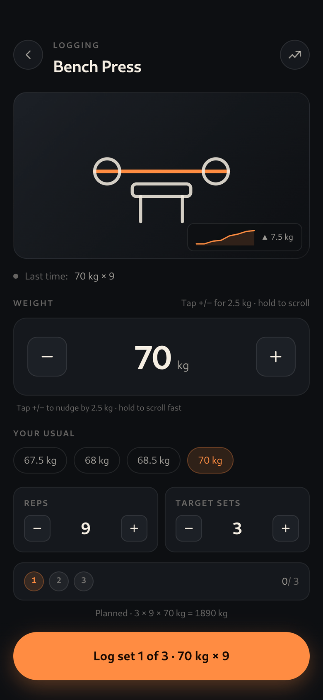
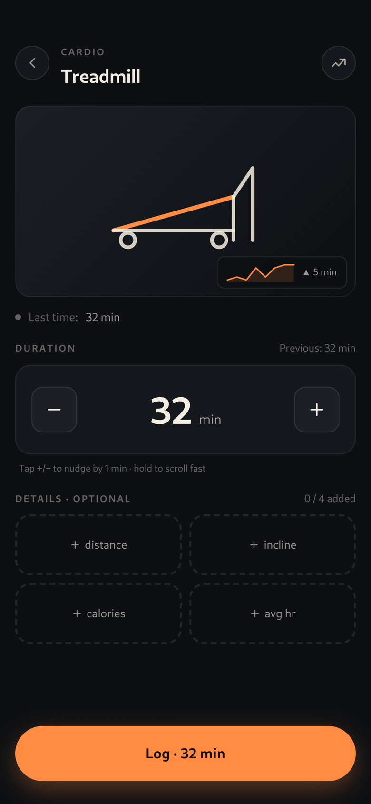
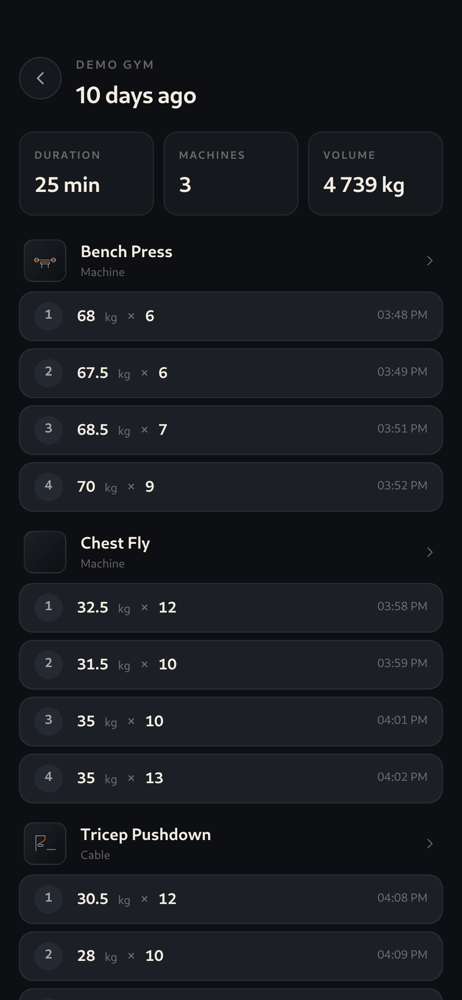
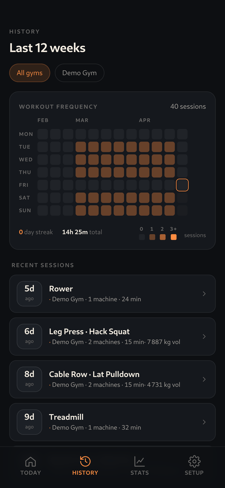
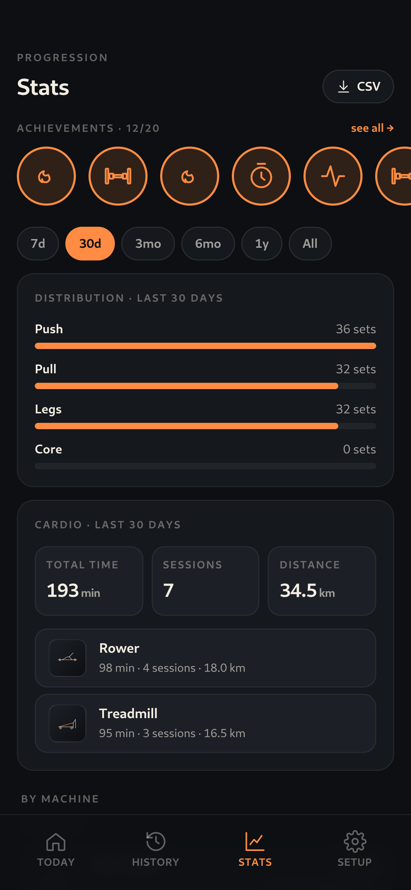
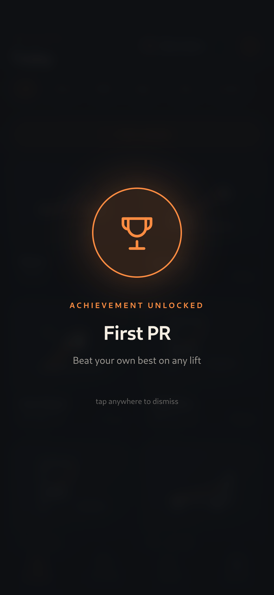

# Trajectory

A self-hosted, equipment-first workout tracker.

[](https://www.gnu.org/licenses/agpl-3.0)
[](https://github.com/jumpingmushroom/Trajectory/actions/workflows/ci.yml)
[](https://github.com/jumpingmushroom/Trajectory/releases)



## What it is

Trajectory is a workout tracker built around the gym you actually train in. Instead of picking from a generic exercise catalog, you set up the specific machines and racks at your gym — that cable row near the mirror, that squat rack in the corner — and tap them to log a set. Sessions, history, progression charts, and achievements come from the equipment, not the abstract exercise. Self-hosted, multi-user, and PWA-installable on iOS and Android.

## Features

- **Equipment-first logging** — your gym's specific machines are the primary objects, not a generic exercise list.
- **Offline-first PWA** — log sets without a connection; an IndexedDB queue drains writes when you're back online.
- **Multi-user with admin-issued accounts** — no public sign-up; the admin invites users by email.
- **Sessions form themselves** — a 90-minute gap starts a new session; a 6-hour gap auto-closes the open one.
- **Achievements + PR detection** — milestone unlocks and per-equipment top-set tracking happen server-side.
- **Strength and cardio** — both are first-class, with templates per cardio kind (treadmill, bike, rower, generic).
- **Stats with progression charts** — per-equipment top-set over time, muscle-group distribution, sparklines.
- **CSV export** — your data is yours.
- **SQLite + Docker** — single bind-mounted volume, no external services to operate.

## Screenshots

| | |
|:-:|:-:|
|  |  |
| Tap a piece of equipment | Set up your gym |
|  |  |
| Log a strength set | Log a cardio session |
|  |  |
| Per-session breakdown | 12-week heatmap |
|  |  |
| Progression charts | Achievements unlock as you train |

## Quickstart

```sh
git clone https://github.com/jumpingmushroom/Trajectory.git
cd Trajectory
cp .env.example .env
# edit .env: set BETTER_AUTH_SECRET, ADMIN_EMAIL, ADMIN_PASSWORD
docker compose up
```

Open <http://localhost:5173> and sign in with the admin credentials from your `.env`. The container handles `pnpm install`, runs Vite with HMR (host edits trigger browser updates without a restart), and persists state to `./data` via a bind mount. Running on the host (`pnpm dev`) is intentionally not supported — the only sanctioned dev workflow is the container.

### Trying it out without entering data

Once the container is up, seed your admin account with eight weeks of believable workout history:

```sh
docker compose exec trajectory node scripts/seed-demo.mjs
```

The script signs in as the admin from your `.env`, creates a demo gym with ten pieces of equipment, and logs ~250 sets across eight weeks of push / pull / leg / cardio sessions. Useful for screenshots, tire-kicking, or seeing what the app looks like populated. Idempotent: bails if any sets already exist on the account. Re-seed by removing `data/db.sqlite` and rebooting.

## Production deployment

Trajectory is designed to live on a **public HTTPS domain**: iOS Safari requires HTTPS for full PWA install (Add to Home Screen + offline cache + standalone launcher), and Better Auth's secure cookies require HTTPS in production.

### Recommended: pull the published image

A multi-arch image (`linux/amd64` + `linux/arm64`) is published to GitHub Container Registry on every release. Self-hosters don't need to clone the repo:

```sh
mkdir trajectory && cd trajectory
curl -O https://raw.githubusercontent.com/jumpingmushroom/Trajectory/main/docker-compose.prod.yml
curl -O https://raw.githubusercontent.com/jumpingmushroom/Trajectory/main/.env.example
mv .env.example .env
# edit .env: set BETTER_AUTH_SECRET, ADMIN_EMAIL, ADMIN_PASSWORD,
# PUBLIC_BASE_URL, and the SMTP_* variables
docker compose -f docker-compose.prod.yml up -d
```

Pin to a specific version (`ghcr.io/jumpingmushroom/trajectory:0.2.0`), the current minor (`:0.2`), or `:latest` — `docker-compose.prod.yml` defaults to `:latest`.

### Manual build (for forks or air-gapped hosts)

If you've forked the repo or need to build without internet access at runtime:

1. Build the prod image: `docker compose build --target prod`.
2. Bind-mount `./data` to a persistent host path (e.g. `/srv/trajectory/data`).
3. Front the container with a reverse proxy (Caddy / Traefik / Nginx) terminating TLS and forwarding to port 5173.
4. Set restart policy to `unless-stopped` so the container survives reboots.
5. Migrations apply automatically on container start; pre-migration snapshots land at `data/db.sqlite.pre-migration-<ISO timestamp>`.

### Required environment

```
NODE_ENV=production
PUBLIC_BASE_URL=https://your-trajectory-domain
BETTER_AUTH_SECRET=<random 32+ char string>

ADMIN_EMAIL=<admin email>            # only consumed when user table is empty
ADMIN_PASSWORD=<initial password>    # admin should change this from /profile

SMTP_HOST=smtp.example.com
SMTP_PORT=587
SMTP_USER=...
SMTP_PASS=...
SMTP_FROM="Trajectory <noreply@your-domain>"
SMTP_SECURE=false                    # true for port 465
```

SMTP is required in production: invites and self-service password resets both rely on email. Missing SMTP config throws on boot rather than silently disabling those flows.

## Backup

Use SQLite's `.backup` API, never `cp` — copying a live SQLite file can copy a torn page.

`scripts/backup.sh` invokes `better-sqlite3`'s online backup API inside the running container, writes a snapshot to `data/backups/db-<ts>.sqlite`, and prunes old snapshots (every snapshot from the last 14 days, plus the newest snapshot per ISO week for the 8 most recent weeks beyond; pre-migration snapshots trim to the 5 most recent).

```sh
# one-shot
./scripts/backup.sh

# daily 04:00 UTC via host crontab
0 4 * * * /srv/trajectory/scripts/backup.sh >> /var/log/trajectory-backup.log 2>&1
```

This script writes snapshots **inside the same `data/` volume** — it protects against in-app data corruption (bad migration, bad write) but not against host disk loss. For off-host protection, schedule restic / borg / rsync of the whole `data/` directory separately.

You can also export your own data as CSV from inside the app (Stats screen → "Export my data as CSV"). Useful for portability and spreadsheet analysis; not a substitute for binary backups (CSV doesn't include equipment photos or DB-internal state). The export is always scoped to the calling user; cross-account export is intentionally not supported.

## Status

This is a single-author project I built for myself. It works well enough that I use it daily, and it might work for you too if your gym fits its assumptions (one or two regular gyms, equipment-first model, comfortable self-hosting on a HTTPS domain). Drive-by PRs welcome; for anything larger than a bug fix, please [open an issue](https://github.com/jumpingmushroom/Trajectory/issues) first so we can talk about scope. Release notes live in [`CHANGELOG.md`](CHANGELOG.md).

## License

[AGPL-3.0](LICENSE) — if you run a modified copy as a service, you must share your modifications.
